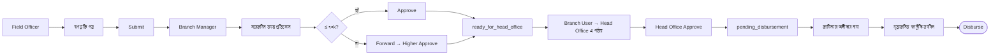
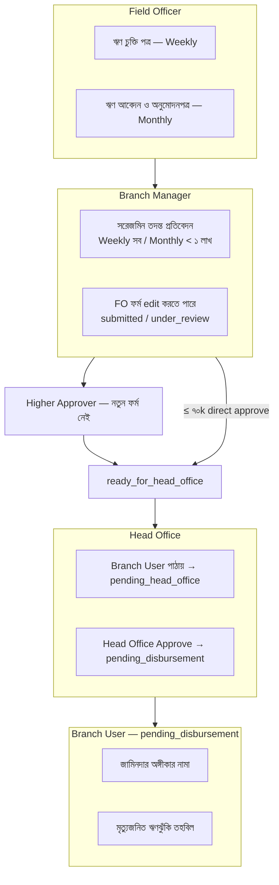
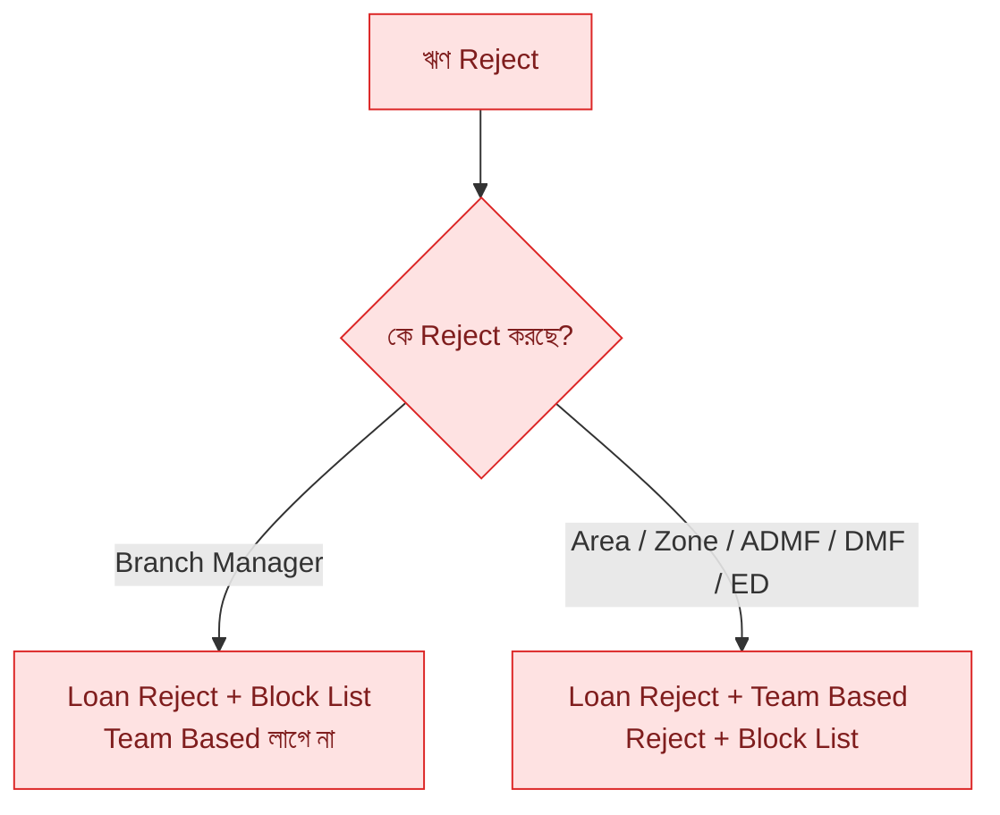

# Loan Application — Form & Approval Workflow

> এই ফাইলটি **editable diagram**। VS Code / Cursor-এ preview করতে Mermaid preview ব্যবহার করুন।  
> Form নাম customize করতে নিচের node label গুলো বদলান — Form number ব্যবহার করা হয়নি।

---

## ফর্ম তালিকা (নাম)

| বাংলা নাম | English | কখন |
|---|---|---|
| ঋণ চুক্তি পত্র | Loan Agreement | FO submit — সাপ্তাহিক |
| জামিনদার অঙ্গীকার নামা | Guarantor Commitment | Disburse আগে — Branch User |
| মৃত্যুজনিত ঋণঝুঁকি তহবিল | Death Risk Fund | Disburse আগে — Branch User |
| সরেজমিন তদন্ত প্রতিবেদন | Field Investigation | BM approve/forward আগে (শর্তসাপেক্ষ) |
| ঋণ আবেদন ও অনুমোদনপত্র | Loan Application & Approval | FO submit — মাসিক |

---

## 1) পুরো Flow (মূল diagram)

```mermaid
flowchart TD
  Start([আবেদন তৈরি<br/>Field Officer]) --> Product{পণ্যের ধরন?}

  Product -->|সাপ্তাহিক / Weekly| LoanAgreement[ঋণ চুক্তি পত্র]
  Product -->|মাসিক / Monthly| LoanApprovalForm[ঋণ আবেদন ও অনুমোদনপত্র]

  LoanAgreement --> Submit[Submit]
  LoanApprovalForm --> Submit

  Submit --> BM[Branch Manager<br/>review / edit]

  BM --> NeedFI{সরেজমিন তদন্ত লাগে?}
  NeedFI -->|Weekly সব<br/>অথবা Monthly &lt; ১ লাখ| FieldInvestigation[সরেজমিন তদন্ত প্রতিবেদন]
  NeedFI -->|Monthly ≥ ১ লাখ| Ceiling
  FieldInvestigation --> Ceiling{পরিমাণ ≤ ৭০,০০০?}

  Ceiling -->|হ্যাঁ| BmApprove[BM Approve<br/>চূড়ান্ত amount]
  Ceiling -->|না| Forward[Forward<br/>+ Team Based]

  Forward --> Higher[Higher Approver<br/>Area / Zone / ADMF / DMF / ED]
  Higher --> HoApprove[Approve]

  BmApprove --> ReadyHO[ready_for_head_office<br/>শাখা অনুমোদিত]
  HoApprove --> ReadyHO

  ReadyHO --> SendHO[Branch User<br/>Head Office এ পাঠায়]
  SendHO --> PendingHO[pending_head_office]
  PendingHO --> HeadOfficeApprove[Head Office Approve]
  HeadOfficeApprove --> Pending[pending_disbursement<br/>বিতরণের জন্য শাখায়]

  Pending --> BranchUser[Branch User]
  BranchUser --> Guarantor[জামিনদার অঙ্গীকার নামা]
  Guarantor --> DeathRisk[মৃত্যুজনিত ঋণঝুঁকি তহবিল]
  DeathRisk --> Disburse([Disburse / বিতরণ])

  classDef form fill:#d1fae5,stroke:#059669,color:#064e3b
  classDef decision fill:#fef3c7,stroke:#d97706,color:#78350f
  classDef action fill:#e0e7ff,stroke:#4f46e5,color:#312e81
  classDef ho fill:#fce7f3,stroke:#db2777,color:#9d174d
  classDef endNode fill:#cffafe,stroke:#0891b2,color:#164e63

  class LoanAgreement,LoanApprovalForm,FieldInvestigation,Guarantor,DeathRisk form
  class Product,NeedFI,Ceiling decision
  class Submit,BM,BmApprove,Forward,Higher,HoApprove,ReadyHO,SendHO,Pending,BranchUser action
  class PendingHO,HeadOfficeApprove ho
  class Start,Disburse endNode
```

---

## 2) Weekly path

---

## 3) Monthly path

```mermaid
flowchart LR
  A[Field Officer] --> B[ঋণ আবেদন ও অনুমোদনপত্র]
  B --> C[Submit]
  C --> D[Branch Manager]
  D --> E{Amount &lt; ১ লাখ?}
  E -->|হ্যাঁ| F[সরেজমিন তদন্ত প্রতিবেদন]
  E -->|না| G{≤ ৭০k?}
  F --> G
  G -->|হ্যাঁ| H[Approve]
  G -->|না| I[Forward → Higher Approve]
  H --> R[ready_for_head_office]
  I --> R
  R --> S[Branch User → Head Office এ পাঠায়]
  S --> T[Head Office Approve]
  T --> J[pending_disbursement]
  J --> K[জামিনদার অঙ্গীকার নামা]
  K --> L[মৃত্যুজনিত ঋণঝুঁকি তহবিল]
  L --> M([Disburse])
```

---

## 4) কে কখন কোন ফর্ম

---

## 5) Reject path

---

## Customize tip

- Node-এর লেবেল বদলাতে `[...]` বা `(...)` ভিতরের টেক্সট এডিট করুন  
- নতুন ধাপ যোগ করতে `-->` দিয়ে edge বাড়ান  
- রঙ বদলাতে `classDef` ব্যবহার করুন  
- Preview: Cursor/VS Code-এ এই `.md` ফাইল খুলে Mermaid preview (বা Markdown preview)
